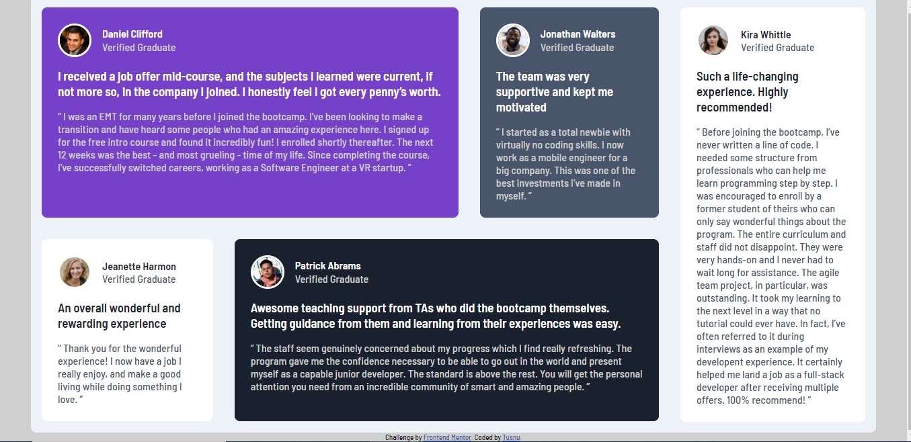

# Frontend Mentor - Testimonials grid section solution

This is a solution to the [Testimonials grid section challenge on Frontend Mentor](https://www.frontendmentor.io/challenges/testimonials-grid-section-Nnw6J7Un7). Frontend Mentor challenges help you improve your coding skills by building realistic projects. 

## Table of contents

- [Overview](#overview)
  - [The challenge](#the-challenge)
  - [Screenshot](#screenshot)
  - [Links](#links)
- [My process](#my-process)
  - [Built with](#built-with)
- [Author](#author)

## Overview

A Frontend Mentor project to replicate a given design with only CSS and HTML.

### The challenge

Users should be able to:

- View the optimal layout for the site depending on their device's screen size

### Screenshot

### Links

- Solution URL: [Solution URL here](https://github.com/Tusnu/testimonials-grid-section)
- Live Site URL: [Live site URL here](https://tusnu.github.io/testimonials-grid-section/)

## My process

I organized a way of how to do this in my mind and I tried to start from there, I researched a little about how to make some parts and in the end it was like this.

### Built with

- Semantic HTML5 markup
- CSS custom properties
- Flexbox

## Author

- Website - [Gabriel L.](https://github.com/Tusnu)
- Frontend Mentor - [@Tusnu](https://www.frontendmentor.io/profile/Tusnu)
- Twitter - [@731Guest](https://twitter.com/731Guest)
